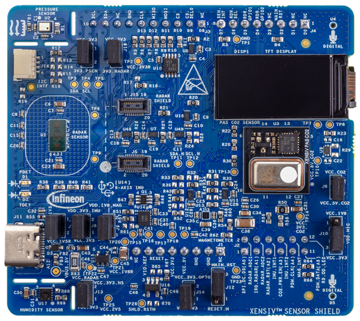

# SHIELD_XENSIV_A sensor shield support library

## Overview

The XENSIV&trade; sensor shield (SHIELD_XENSIV_A) has been designed such that a TFT display, several sensors, microphones can interface with an Arduino based baseboard.

## Features

It comes with the features below to enable everyday objects to connect to the Internet of Things (IoT).
- XENSIV&trade; 60 GHz radar sensor (BGT60LTR11AIP)
- XENSIV&trade; Digital barometric pressure and temperature sensor (DPS368)
- XENSIV&trade; Disruptive CO2 sensor (PAS CO2)
- 0.96 inch TFT display (ST7735S)
- Digital humidity and temperature sensor (SHT35)
- Motion sensor (BMI270)
- Magnetometer sensor (BMM350)
- XENSIV&trade; MEMS digital microphone (IM72D128)

This shield has a 0.96 inch 80×160 TFT display with a Sitronix ST7735S display controller and uses the SPI Interface.

The shield library provides support for:
- Initializing/freeing all of the hardware peripheral resources on the board
- Defining all pin mappings from the Arduino interface to the different peripherals
- Providing access to each of the underlying peripherals on the board

This library makes use of support libraries: [sensor-humidity-sht3x](https://github.com/infineon/sensor-humidity-sht3x), [sensor-motion-bmi270](https://github.com/infineon/sensor-motion-bmi270), [sensor-orientation-bmm350](https://github.com/infineon/sensor-orientation-bmm350), [sensor-xensiv-dps3xx](https://github.com/infineon/sensor-xensiv-dps3xx), [sensor-xensiv-pasco2](https://github.com/infineon/sensor-xensiv-pasco2), [display-tft-st7735s](https://github.com/infineon/display-tft-st7735s).

The SHILED_XENSIV_A sensor shield board uses the Arduino Uno pin layout plus an additional 6 pins. It is compatible with the PSoC&trade; 6 Pioneer Kits. Refer to the respective kit guides for more details.

**Figure 1. SHIELD_XENSIV_A XENSIV&trade; sensor shield**



## Quick Start

[Basic shield usage](#basic-shield-usage)

[Display usage](https://github.com/infineon/display-tft-st7735s#quick-start)

[Humidity sensor usage](https://github.com/infineon/sensor-humidity-sht3x#quick-start)

[Motion sensor usage](https://github.com/infineon/sensor-motion-bmi270#quick-start)

[Magnetometer sensor usage](https://github.com/infineon/sensor-orientation-bmm350#quick-start)

[Pressure sensor usage](https://github.com/infineon/sensor-xensiv-dps3xx#quick-start)

[CO2 sensor usage](https://github.com/infineon/sensor-xensiv-pasco2#quick-start)

## Basic shield usage

Follow the steps below to create a simple application which outputs the pressure sensor data from the sensor to the display.

1. Create an empty application.
2. Add this library (SHIELD_XENSIV_A) and emWin library to the application using the library manager.
3. Enable EMWIN_NOSNTS emWin library option by adding it to the Makefile COMPONENTS list:

    ```
    COMPONENTS+=EMWIN_NOSNTS
    ```
4. Place the following code in the main.c file:

    ```
    #include "cyhal.h"
    #include "cybsp.h"
    #include "shield_xensiv_a.h"
    #include "GUI.h"

    int main(void)
    {
        cy_rslt_t result;
        xensiv_dps3xx_t* pressure_sensor;
        float pressure, temperature;

        /* Initialize the device and board peripherals */
        result = cybsp_init();

        /* Board init failed. Stop program execution */
        if (result != CY_RSLT_SUCCESS)
        {
            CY_ASSERT(0);
        }

        /* Enable global interrupts */
        __enable_irq();

        /* Select the display SPI CS */
        result = cyhal_gpio_init(SHIELD_XENSIV_A_PIN_SPI_CS_SEL0, CYHAL_GPIO_DIR_OUTPUT, CYHAL_GPIO_DRIVE_STRONG, true);
        if (result != CY_RSLT_SUCCESS)
        {
            CY_ASSERT(0);
        }

        /* Initialize SHIELD_XENSIV_A */
        result = shield_xensiv_a_init(NULL, NULL, NULL, NULL);
        if (result != CY_RSLT_SUCCESS)
        {
            CY_ASSERT(0);
        }

        GUI_Init();

        /* Get the pressure sensor object */
        pressure_sensor = shield_xensiv_a_get_pressure_sensor();

        for (;;)
        {
            /* Get the pressure and temperature data and print the results to the TFT display */
            xensiv_dps3xx_read(pressure_sensor, &pressure, &temperature);

            GUI_DispStringAt("Pressure: ", 1, 1);
            GUI_DispFloat(pressure, 7);

            GUI_DispStringAt("Temperature: ", 1, 11);
            GUI_DispFloat(temperature, 7);

            cyhal_system_delay_ms(1000);
        }
    }
    ```
## More information

For more information, refer to the following documents:

* [API Reference Guide](./api_reference.md)
* [ModusToolbox Software Environment, Quick Start Guide, Documentation, and Videos](https://www.infineon.com/cms/en/design-support/tools/sdk/modustoolbox-software)
* [Infineon Technologies AG](https://www.infineon.com)

---
© 2024, Cypress Semiconductor Corporation (an Infineon company) or an affiliate of Cypress Semiconductor Corporation.
